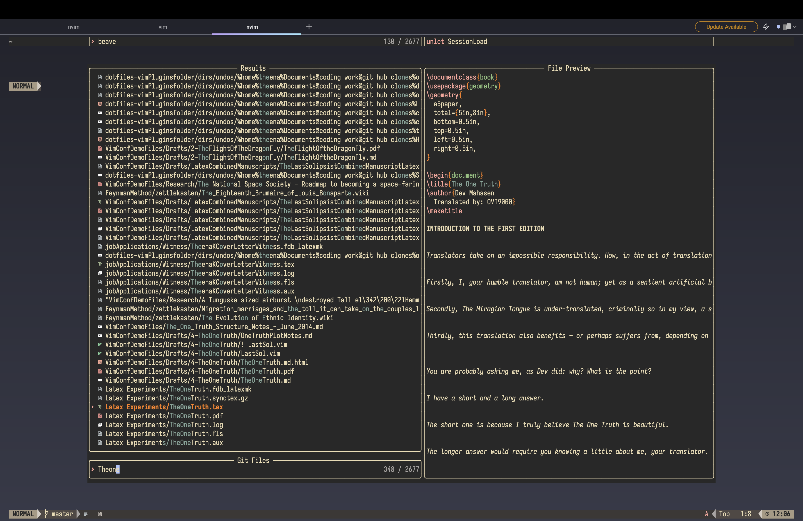
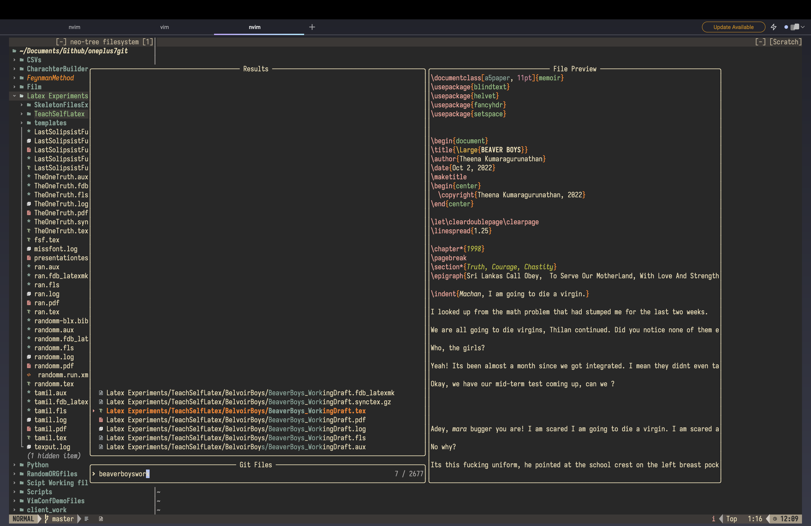

**A Vim/NeoVim Configuration for Writing and Writers**

[]

## WHAT THE HECK IS 'OVIWrite'?

OVIWrite (as in *Oh-We-Write*) is an attempt to make (Neo)Vim writer friendly out of the box.

## WHY?

I am a writer, not a tech person. 

Coming across Vim for the first time last year was revelatory, but I'd be lying if I said the adoption process was easy. Indeed, it took me over two months to get Vim ready for my writing workflow. I was persistent but most users and writers aren't going to spend the time needed to get Vim up and running.

This is a crying shame; most writers would abandon Vim as too complex a beast at this point. I too would have abandoned it but the Vim community on YouTube came to the rescue. 

This repo is an attempt to address that potential loss of a user-group who stand to gain much from Vim.

## TESTING 

This .vimrc has served me well on Linux, MacOS and Android (via Termux). I've tested it on the following systems:

A. **Linux**
    1. Ubuntu 20.04. Should work on Ubuntu derivatives such as pop!OS, Kubunutu, etc.,
    2. Debian 11
    3. Arch. Worked on Vanilla Arch, Arco-Linux and Garuda Linux. 

B. **MacOS High Sierra** (I have a 10 year old Mac so this is the best I can do for the time being)

C. **Android**
    I have a OnePlus7T, running Android 11 (or OxygenOS 11.0.a.1 more precisely), with Termux. A note on Termux available on the Google Play Store: it seemingly doesn't get any updates and I can barely install any packages any more, which is why I moved to Termux version available on F-Droid. The repos are fresh, updated and have had no issues since moving. 

D. **Windows**
    Yet to attempt testing on Windows. 

## KEY-BINDINGS

The key-bindings I've used here are built around my (admittedly) wonky typing and keyboard recall. The SPACEBAR is the Leaderkey because it is the most ergonomically sound for me. If you feel otherwise, you are free to change. 

## PLUGINS FOR WRITING AND WRITERS 

As this .vimrc aims to be plug and play for writers interested in using Vim for their writing, I have chosen a fairly opinionated approach to what plugins (see section on Plugins for more details), what defaults (line-wrapping, relative numbers, etc.,), are necessary to begin writing on Vim immediately. This doesn't mean that this .vimrc can't be changed based on user preference; indeed Vim truly shines when you take the time to mould it for your **exact** specifications.  The .vimrc has extensive comments to enable the final user to add, remove, and modify to their heart's content. 

Most of these plugins are written in VimL, as opposed to NeoVim plugins written in Lua. The general rule of thumb that I follow is: **Most plugins written for Vim work on NeoVim**, but **plugins written in Lua for NeoVim will not work** on Vim.

Therefore, all plugins curated in this vimrc will be Vim-first i.e they should run perfectly fine on any any Vim install on any system as long as Vim 8.0 or greater is installed. 

Plugins will be organized into levels. 

### *Level 1* 

This is what I would consider the bare minimum for writing and writers: spelling support, distraction-free writing, dictionary and thesaurus functionality, and maybe a Grammerly-like function that suggests changes to a given text. 

**GOAL**: Make Vim the fastest, smartest, most portable writing scratchpad.

### *Level 2* 

The plugins in this level will turn Vim into a note-taking machine. At this point, you can conceivably use Vim as a note-taking tool in lectures, as I do.  We will combine markdown, org-mode and vim-wiki to give users three distinct and incredibly powerful tools to take down better, more effective notes.

**GOAL**: Make Vim the fastest, smartest, most portable note-taking environment.

### *Level 3* 

The Level 3 plugins will turn Vim into a cutting edge production-ready writing environment that gives writers end-to-end granular control of their writing output. We will add Pandoc and Latex support, making it easier to produce beautiful documents that are a couple of key presses away. 

**GOAL**: Make Vim the *Writing Environment* of your dreams. From initial idea to final output, nothing should be beyond the reach of this final version of Vim.

## CAN I CONTRIBUTE?

Please, and thank you. 

Contributions are encouraged. Feel free to make a pull request with modifications. If you want to contribute at a deeper level - maybe even forking NeoVim for writing outright - do reach out to me. I will be happy to collaborate and learn from the community. 

### TODO: 

- Demo [  ]
- Windows Testing [  ]
- Tutorials [  ]
- Detailed documentation [  ]
- Screenshots [  ]

## Authors

- [@MiragianCycle](https://www.github.com/MiragianCycle), Theena Kumaragurunathan
- [@mhegreberg](https://github.com/mhegreberg), Mark Hegreberg

## License

[GNU GPLv3](https://choosealicense.com/licenses/gpl-3.0/)

