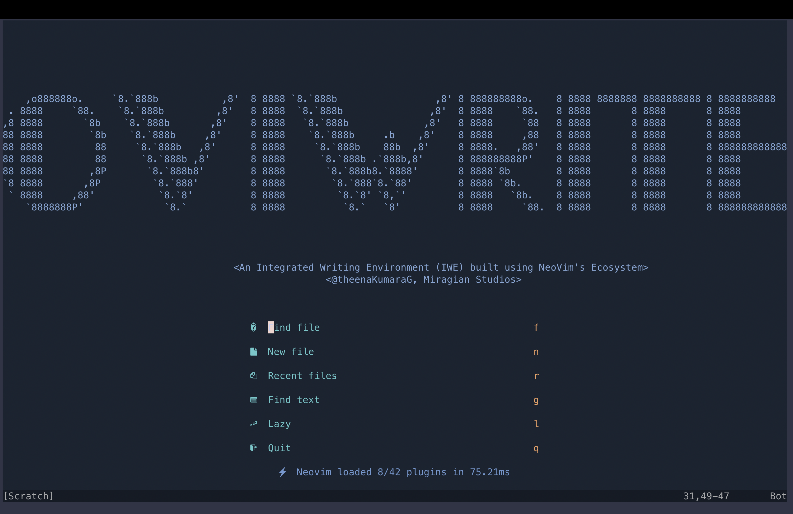
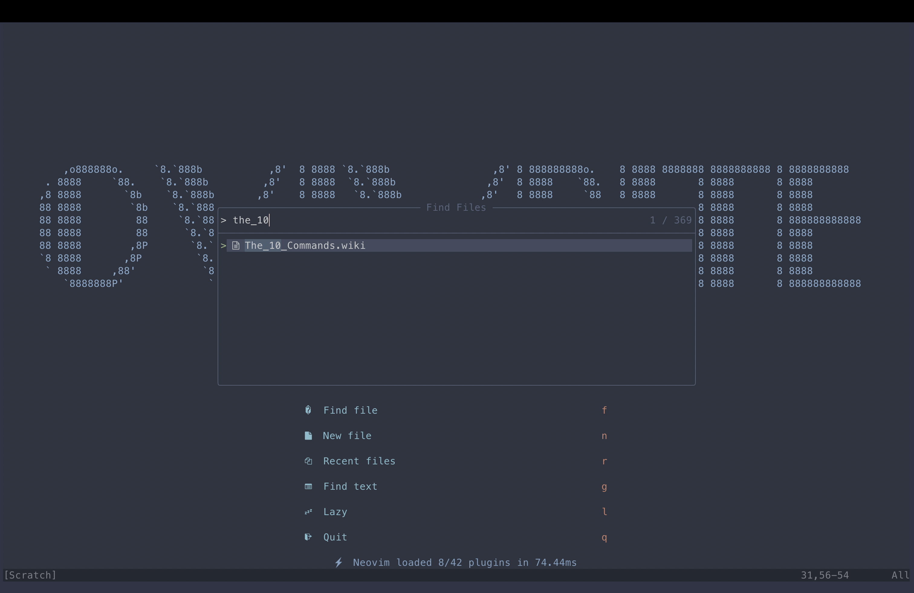
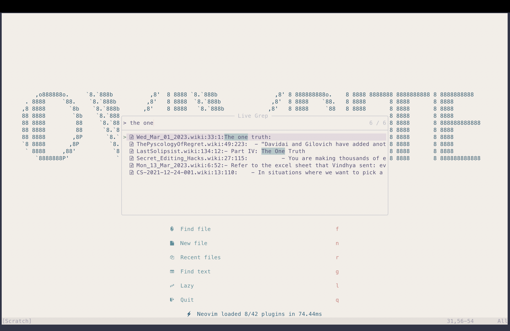
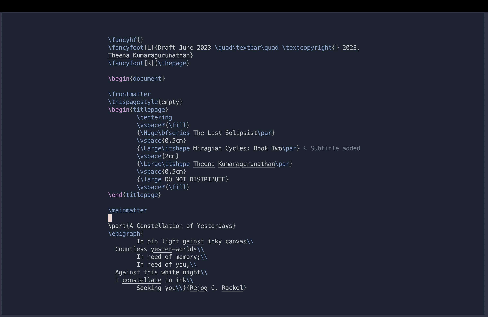
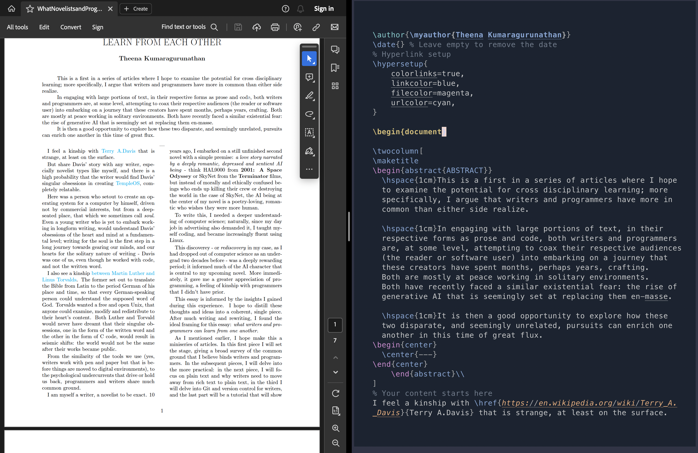
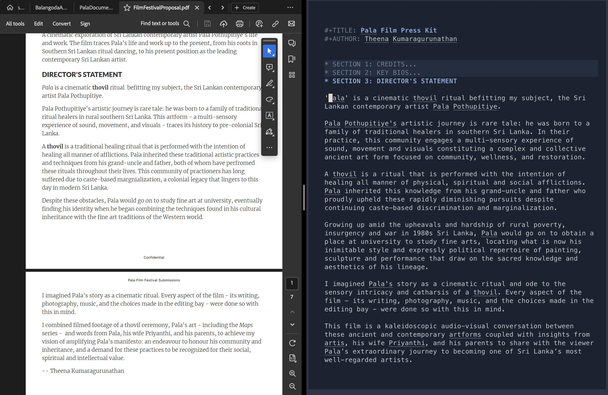
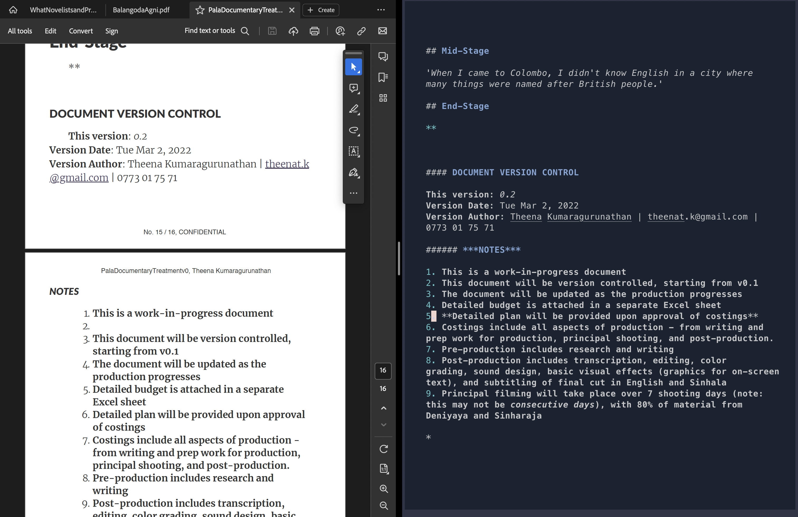
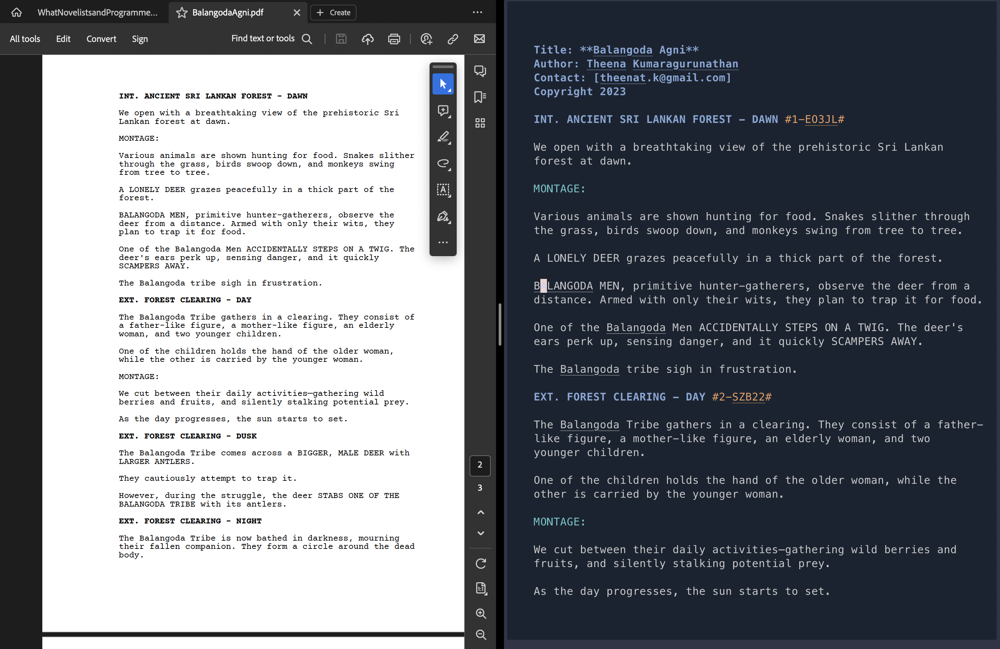
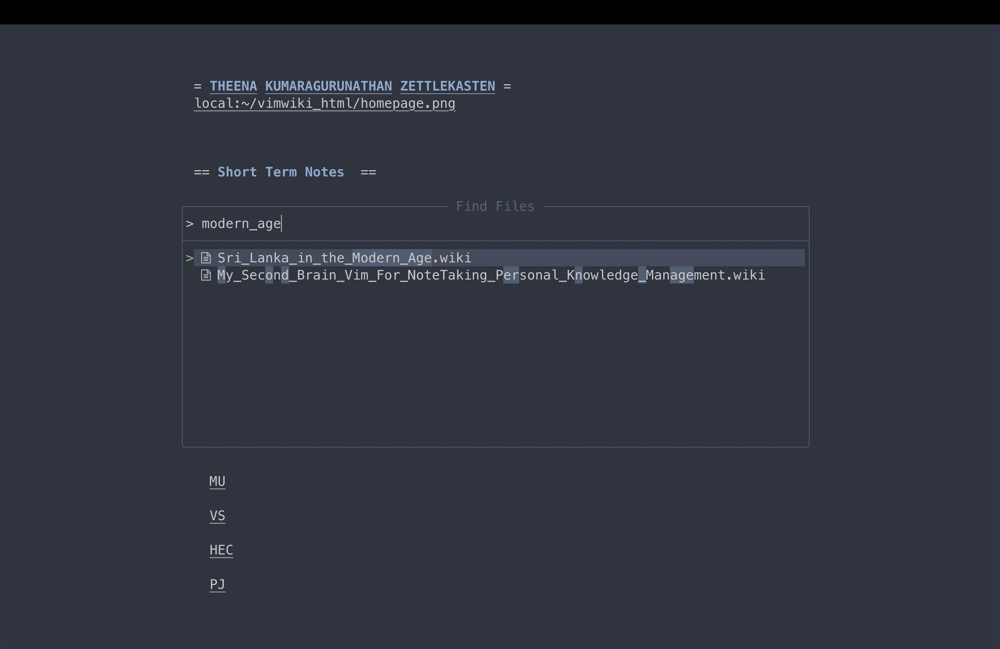

# **A Writer's NeoVim**
 





- 🔥 Transform your Neovim into a full-fledged IWE
- 💤 Easily customize and extend your config with [lazy.nvim](https://github.com/folke/lazy.nvim)
- 🚀 Stupid fast
- 🧹 Sane default settings for options for writers
- 😻 Eye candy in the form of beautiful color schemes, including flavours of Catppuccin, Gruvbox, Nord, NightFox
- 📦 Comes with a wealth of plugins for longform writing, interconnected note-taking (wikis, etc.), and screenwriting. All pre-configured and ready to use

## 🔎 OVI-WHAT NOW? 

OVIWrite is a [NeoVim](https://neovim.io/) powered Integrated Writing Environment (IWE) built using [LazyVim](https://lazyvim.github.io/) and [💤 lazy.nvim](https://github.com/folke/lazy.nvim). 

The goal is to make it as easy as possible for writers to start using NeoVim out of the box. 

This begs the question: what *kind* of writer would gravitate towards OVIWrite? It is a fair question and it is covered in detail below.

Vim, at first, and now NeoVim have formed the basis of my dream writing environment. Who even dreams of their writing tools? Good question, I have no answers except to say that I do venture outside regularly to touch grass - don't worry.

I wanted a writing tool that ticked these boxes:

 - Fast AF
 - Switched seamlessly between three specific kinds of writing
   - Long form prose (i.e. novels, academic writing, essays)
   - Research and note-taking
   - Screenwriting
 - Supported a wide range of plain text standards such as Markdown and LaTeX. 
 - Adaptable to any platform, desktop or mobile, Android or IOS
 - Had the features of traditional word processors (Spell and Grammar checking for instance)
 - Had quality of life improvements such as Version Control through Git
 
This is a tall order to ask for Word Processors. 

It is why conventional word processing software such as MS Word fails, at least for me. Granted I wrote my first novel on MS Word, I found that it was neither extensible enough to scale with my needs, nor was it nimble and fast. 

An ideal writing tool for me should adapt to my needs at a moment's notice:

- Focus on the novel? Sure, here's a beautiful LaTeX template for me to work on my novel.
- Write a screenplay? Why not?
- Build an inter-connected network of notes like Obsidian or Notion? Done. 

Here are two demos I presented at the [NeoVimConf](https://neovimconf.live/) where I presented two early versions of OVIWrite.

- [Writing, Editing and World-Building at the Speed of Thought](https://www.youtube.com/watch?app=desktop&v=2ORWaIqyj7k) (ver 0.1)
- [Vimkipedia: Or How I Built my Second Brain Using Vim](https://www.youtube.com/watch?v=q80hXvorl0o) (version 0.2)

Essentially, these two talks served as early demos of OVIWrite versions 0.1 and 0.2. However, I used a combination of Vim and NeoVim during these talks. This was because I couldn't get the some Vim-specific plugins to work with NeoVim, a problem that I have since solved. 

The config is now entirely built with Lua, following the modular structure of LazyVim. 

I consider this version 0.4 (Dec 11th 2023)

I currently run this version of OVIWrite on my Mac (MacOS Sonoma 14.1.2), Linux (popOS 22.04), and Android 12 (OxygenOS 12.1 on a OnePlus 7T). 


## ⌨️  IWE

The solution to my problem with my writing tools was simple: I needed an Integrated Writing Environment, a toolkit that was nimble and fast, yet extensible to meet all my *text* needs. I spent time writing on diverse IDEs;
in fact, my inspirations for OVIWrite were [VSCode](https://code.visualstudio.com/), [PyCharm](https://www.jetbrains.com/pycharm-edu/) and indeed the many Vim/NeoVim inspired *distros* like [NVChad](https://nvchad.com/), [LunarVim](https://www.lunarvim.org/), and [Doom Emacs](https://github.com/doomemacs/doomemacs). 


## 🎹 FEATURES

I use this setup for the following use-cases:

- LaTex documents for my novels and academic writing
- Fountain files for writing scripts and screenplays
- Markdown and Org Mode files for writing simpler reports and blogs
- Vim-wiki for my personal Zettelkasten 

OVIWrite allows users to write in Markdown, LaTeX, Fountain (For Screenwriting) while, at the same time, having allowing the user to build a Personal Knowledge Base system (such as a Zettelkasten). See screenshots below. 

This setup is built to be as frictionless as possible for a reasonably experienced Vim/NeoVim user to install and get to writing.
OVIWrite has been tested on Linux, MacOS and Android (through Termux available on the F-Droid store [not Google Play Store]) environments.

Windows users: I would love feedback on your experiences as well as contributions.

The documentation here, much like the source code, is a fork of Lazy Vim. Thanks to the good folk there who have done an incredible job making this NeoVim distribution frictionless for us non-tech folk. 

## 🔌 PLUGINS 

| Plugins               | Type                                                                                |
|-----------------------|-------------------------------------------------------------------------------------|
| LanguageTool.lua      | Spelling and Grammar                                                                |
| alpha.lua             | Splash Screen                                                                       |
| autopairs.lua         | Automatically close brackets and quotation marks                                    |
| catppuccin.lua        | Color Scheme                                                                        |
| comment.lua           | Commenting of text                                                                  |
| fountain.lua          | Screenwriting                                                                       |
| fzf-vim.lua           | Fast search for files and words                                                     |
| goyo.lua              | Distraction Free Writing                                                            |
| gruvbox.lua           | Color Scheme                                                                        |
| img-clip.lua          | Paste images into Markdown and LaTeX buffers                                        |
| lazygit.lua           | Version control for GitHub                                                          |
| limelight.lua         | Distraction free writing                                                            |
| markdown-preview.lua  | Preview Markdown files                                                              |
| mason-lspconfig.lua   | LSP                                                                                 |
| mason.lua             | LSP                                                                                 |
| nightfox.lua          | Color scheme                                                                        |
| noice.lua             | System notifications                                                                |
| nvim-tree.lua         | File explorer                                                                       |
| nvim-treesitter.lua   | Treesitter integration                                                              |
| nvim-web-devicons.lua | Pretty icons                                                                        |
| nvimorgmode.lua       | Org-mode                                                                            |
| obsidianNvim.lua      | Support for editing Obsidian files                                                  |
| pomo.lua              | Pomodoro timer                                                                      |
| telescope.lua         | Telescope, for fast search across buffers, directories, help documentation, etc.,                                                                      |
| translate.lua         | Translate to and from English, Tamil, Sinhala and French                                                                                                 |
| twilight.lua          | Yet another distraction free writing aid                                                                                                                                             |
| vim-grammarous.lua    | Grammar checker                                                                                                                                                                                                               |
| vim-latex-preview.lua | Preview LaTeX documents                                                                                                                                                                                                                                                                             |
| vim-pencil.lua        | line wrapping for prose                                                                                                                                                                                                                                                                                                                                             |
| vim-wiki.lua          | Personal knowledge management tool                                                                                                                                                                                                                                                                                                                                                                                              |
| vim-zettel.lua        | Zettelkasten function                                                                                                                                                                                                                                                                                                                                                                                                                                                           |
| vimorg.lua            | additional Org-Mode support within NeoVim                                                                                                                                                                                                                                                                                                                                                                                                                                                                                                        |
| vimtex.lua            | LaTeX support                                                                                                                                                                                                                                                                                                                                                                                                                                                                                                                                                                               |
| whichkey.lua          | Keyboard binding lookup                                                                                                                                                                                                                                                                                                                                                                                                                                                                                                                                                                                                                                             |
| zen-mode.lua          | Distraction Free writing                                                                                                                                                                                                                                                                                                                                                                                                                                                                                                                                                                                                                                            |

## KEYBOARD SHORTCUTS

**OVIWrite** uses [which-key.nvim](https://github.com/folke/which-key.nvim) to help you remember your
keymaps. Just press any key like `<space>` and you'll see a popup with all
possible keymaps starting with `<space>`.


- default `<leader>` is `<space>`

<!-- keymaps:start -->

### Startup 

| Key | Mode   | Description     |
|-----|--------|-----------------|
| f   | Normal | Find files      |


## ⚡️ REQUIREMENTS

- Neovim >= **0.8.0** and its associated dependencies (needs to be built with **LuaJIT**)
- Git >= **2.19.0** (for partial clones support)
- a [Nerd Font](https://www.nerdfonts.com/) **_(optional but highly recommended)_**
- LaTeX compiler
- [Pandoc](https://pandoc.org/)

## 📺 SCREENSHOTS

The screenshots below show a variety of color schemes at play: Nightfox, DawnFox and NordFox. Also included in the config: Gruvbox and flavours of Catppuccin. 

### Long-form Writing

- Longform Writing; LaTeX






- Longform Writing; Org-Mode
 
 

 
 
- Longform Writing; Markdown




### Screenwriting 

- Screenwriting in Fountain format



### Note-taking and Research

- Zettelkasten 




## 👨💻 AUDIENCE 

Writers who are drawn to Vim/NeoVim often exhibit specific characteristics that align with the philosophy and functionality of these text editors. 

Personally, I think of Vim/NeoVim as analogous to a musical instrument, say a piano. The first interaction with a piano is often messy, confusing and overwhelming; stick with it, and there is a little bit of magic waiting to be experienced. 

### I am a writer, not a tech person. This looks overwhelming. Is this for me?

Only you can answer that. 

No lie: there is a investment in time required to understand how to use Vim/NeoVim's modal editing. There is also some steep knowledge acquisition required to understand NeoVim's internal nuts and bolts so that you can get it to work *exactly* as you want it to. OVIWrite offers a base to start your own explorations. That said, there are broadly three kinds of writers that can use OVIWrite:

- Tech-Savvy Writers
- Detail-Oriented and Patient
- Efficiency-Seekers
 


### Rewarding Long-Term Benefits:

I can only offer personal anecdotes here in lieu of a more scientific approach. In the three years since I discovered Vim/NeoVim for myself, I have steadily become very productive. The procrastination associated with writing has disappeared, and I believe part of that is because I don't have to struggle through the bloated mess that is MSWord. Editing too has become a joy because editing is Vim's superpower. 

# INSTALLATION

## First Steps (Linux, Mac and Windows)


1. Install NeoVim. Ensure that it is close to the latest version i.e. > 0.8, but preferably 0.9
2. Install Pandoc
3. Install Git
4. Install a Terminal emulator like Kitty/Alacritty/Konsole/iTerm
5. Install a minimalist PDF reader like Zathura or Skim

## Linux and MacOS

1. Install brew from [here](https://brew.sh/) using the following command: ```/bin/bash -c "$(curl -fsSL https://raw.githubusercontent.com/Homebrew/install/HEAD/install.sh)"```

2. Run the following commands: 

```brew update
brew doctor
brew upgrade
brew install node
brew install python
brew install fzf
brew install ripgrep
brew install pandoc
brew install pandoc-plot
brew install npm
brew install wget
sudo pip3 install neovim-remote
pip3 install --user pynvim
brew install --cask mactex
```

3. Reboot your machine. Open NeoVim and type ':' to go into command mode. Type 'checkhealth'

## Windows

I am unsure of package managers for Windows and how they work. Testing will be done soon and documentation will be expanded after that. 


## Installing OVIWrite

### Unix Systems (Linux and MacOS)

```bash
# Clone the repository
git clone https://github.com/MiragianCycle/OVIWrite.git

# Move the 'nvim' folder to the NeoVim configuration directory
mv OVIWrite/nvim ~/.config/nvim
```

### Windows

```cmd
:: Clone the repository
git clone https://github.com/MiragianCycle/OVIWrite.git

:: Move the 'nvim' folder to the NeoVim configuration directory (example: %APPDATA%\Local\nvim)
move OVIWrite\nvim %APPDATA%\Local\nvim
```


### 🚗 ROADMAP

	    - [ ] Public demo on YouTube
	    - [ ] Testing out on non Unix systems i.e. Windows
	    - [ ] Documentation
		    - [ ] Website on GitHub maybe?
			    - [ ] Blog: The case for writing in plain text
	    - [ ] Installation streamlining


## 🤝 CAN I CONTRIBUTE?

Please, and thank you. 

Contributions are encouraged. Feel free to make a pull request with modifications. If you want to contribute at a deeper level - maybe even forking NeoVim for writing outright - do reach out to me. I will be happy to collaborate and learn from the community. 

## ䷑ Authors

- [@MiragianCycle](https://www.github.com/MiragianCycle), Theena Kumaragurunathan
- [@mhegreberg](https://github.com/mhegreberg), Mark Hegreberg


## 🎁 ACKNOWLEDGEMENTS 

None of this would be possible without the contributions of the entire Vim and NeoVim eco-systems. Please contribute in anyway, financial or otherwise, to these incredible projects and the tireless people who maintain them. 


## License

[GNU GPLv3](https://choosealicense.com/licenses/gpl-3.0/)


