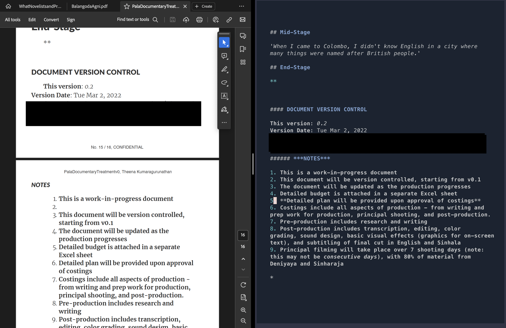

# **2025 Update: Project Pause And Call for Maintainers**

It's been apparent for a while that I haven't been as involved or as attentive of OVIWrite as I should be. You needn't look beyond my belated responses to PRs and issues to confirm this. 

There are many reasons for this: work primarily (as in actual writing work, not fighting apparent technical debt over a software project), and because  I've moved to Emacs. 

Setting up Emacs for the same scope of work as OVIWrite was considerably easier than it was on Neovim: the eco-system for writing/prose work/note-taking/personal knowledge management already exists in Emacs land, is mature, well-maintained, and honestly a joy to use. Creating an IWE out of Emacs was barely a couple of days work around Nov 2024; almost a year later, I find myself writing more and barely tinkering config files as I did with OVIWrite. This is despite the fact that I've grown to love Emacs-Lisp. 

My point is that is I am seeking to pass this project on to someone who is interested in taking over maintenance. Please reach out if you are interested, and I'll be happy to pass the reigns over to you. 

Is there an ideal person(s) who would be best suited for leading a project like this? 

Obviously, I---and our small group of users---would want a writer or writer(s) to helm these efforts, if only because such a person(s) would understand and empathize with our core audience and their need to have a writing tool that goes beyond the capabilities of conventional word processors. 

Such a person should also not be overawed by a code base---while this OVIWrite config is relatively small and simple in scope, to call it a *code base* would be a stretch, it still requires writers who aren't afraid to get their hands dirty with lua code. In short, the role of OVIWrite's maintainer is someone who falls in the intersection between writing and hacking (I use the term 'hacking' in its broader, positive connotation: i.e. someone skilled enough in the use of computer technology to be able to create tools for their individual use.)

A deep note of gratitude to the Neovim community for making me feel welcome, and for always helping me when I ran into inevitable technical issues that were way over my head. 

A big thank you also to the OVIWrite's many users (all dozen or so of you). When I undertook this silly project to create an IWE out of a programmer's tool, I was pretty sure that no other writer would ever have any use for it. 

How wrong I was. 

Many of you have emailed---and continue to email---with kind words, general observations, and technical queries. The 20 year old me who dropped out of his undergrad computer science degree because *he didn't understand how to code* would be very surprised and confused at this turn of events. 

Finally, happy writing! Go create amazing stories, characters and worlds for the rest of us to wander in. 

## Contact 
My regular email address is easy enough to find online. Get in touch if you want to take over OVIWrite. Or if you want to say hello. 


# **A Writer's NeoVim**
 


- 🔥 Transform your Neovim into a full-fledged Integrated Writing Environment (IWE): Write, Edit and World-build at the speed of thought 
- 💤 Easily customize and extend your config with [lazy.nvim](https://github.com/folke/lazy.nvim)
- 🚀 Stupid fast
- 🧹 Sane default settings and options for writers
- 😻 Eye candy in the form of beautiful color schemes, in dark and light modes, including flavours of Catppuccin, Gruvbox, Nord, NightFox
- 📦 Comes with a wealth of plugins for longform writing, interconnected note-taking (wikis, etc.), and screenwriting. All pre-configured and ready to use


## 🔎 OVI-WHAT-NOW? 

 

OVIWrite is a [NeoVim](https://neovim.io/) powered Integrated Writing Environment (IWE) built using [LazyVim](https://lazyvim.github.io/) and [💤 lazy.nvim](https://github.com/folke/lazy.nvim). 

The goal is to make it as easy as possible for writers to start using NeoVim out of the box. 

This begs the question: what *kind* of writer would gravitate towards OVIWrite in the first place? Good question. I spend some time discussing it below.

At first Vim, and now NeoVim, have formed the basis of my dream writing environment. Who even dreams of their writing tools? I have no answers except to say that I do venture outside regularly to touch grass and talk to people - don't worry.

I wanted a writing tool that ticked these boxes:

 - Fast AF
 - Switches seamlessly between three specific kinds of writing
   - Long form prose (i.e. novels, academic writing, reports, essays)
   - Research and note-taking
   - Screenwriting
 - Supported a wide range of plain text standards including Markdown and LaTeX. 
 - Adaptable to any platform, Unix style OSs (MacOS, Linux) or otherwise (Windows), desktop or mobile, Android or iOS
 - Offered the features of traditional word processors (Spell and Grammar checking for instance)
 - Offered opinionated quality of life improvements such as Version Control through Git
 
This is a tall order to ask for word processors. It is why conventional word processing software such as MS Word fails, at least for me. 

Granted I wrote my first novel on MS Word, I came to find that it wasn't extensible enough to scale with my needs, nor was it nimble and fast. 

An ideal writing tool should adapt to a writer's needs at a moment's notice.

- Get back to working on the novel? Sure, here's a beautiful LaTeX template for me to work on my novel.
- Write a screenplay? Why not?
- Build an inter-connected network of notes like Obsidian or Notion? Done. 

Here are two demos I presented at the [NeoVimConf](https://neovimconf.live/) where I presented two early versions of OVIWrite.

- [Writing, Editing and World-Building at the Speed of Thought](https://www.youtube.com/watch?app=desktop&v=2ORWaIqyj7k) (version 0.1) (Nov 2021)
- [Vimkipedia: Or How I Built my Second Brain Using Vim](https://www.youtube.com/watch?v=q80hXvorl0o) (version 0.2) (Dec 2022)

Essentially, these two talks served as early demos of OVIWrite versions 0.1 and 0.2. However, the eagle-eyed among you will notice I used a combination of Vim and NeoVim during these talks. This was because I couldn't get some Vim-specific plugins to work with NeoVim, a problem that has since been solved. 

This version of OVIWrite is built entirely in Lua, and follows the modular structure of LazyVim. 

This is version 0.4 (Dec 11th 2023)

### Nomenclature 

You will notice that Vim and NeoVim are used interchangeably here. This might appear confusing at first so let's be clear: 

- Vim is a text editor whose roots go back to the early 80s. Its creator was the late [Bram Moolenaar
](https://en.wikipedia.org/wiki/Bram_Moolenaar). Among its many innovations that have aged well in its four decades is the notion of [Modal Editing](https://phoenixnap.com/glossary/modal-editor#:~:text=A%20modal%20editor%20is%20a,to%20perform%20different%20tasks%20efficiently.). Modal editing text editors like Vim change your keyboard functionality based on what mode you are in. 
- Vim allows for a number of modes: Normal, Insert, Visual, Command and Replace modes.  
- NeoVim is a 'fork' of Vim, a modern interpretation of what Vim can be. It's about a decade old and is maintained by a core group of maintainers, led by [Justin M. Keyes](https://neovimconf.live/speakers/justin/). It inherits Vim's modal-editing philosophy, but has moved to a modern programming language: [Lua](https://en.wikipedia.org/wiki/Lua_(programming_language))
- Both Vim and NeoVim have rich eco-systems that extend the editor's functionality to suit the exact needs of the user. 
- These eco-systems are thriving as a result of tireless plugin makers, some of whom have created, and continue to maintain, dozens of plugins
- Most plugins are created for explicit software engineering/programming tasks. A few plugins are created for writing of prose or other text manipulation tasks outside of conventional programming
- OVIWrite is based on NeoVim; specifically it is based on an existing NeoVim starter kit [LazyVim](https://www.lazyvim.org/)
- OVIWrite uses a curated list of writing-centric plugins along with some plugins that are traditionally for software engineering tasks, but whose functionality has application in the work of writers or anyone working with large chunks of text


## 👨💻 AUDIENCE 

I hear you: Who is this for? 

Personally, I think of Vim/NeoVim as analogous to a musical instrument, say a piano. Are pianos meant only for world-class pianists? No.

The first interaction with a piano is often messy, confusing and overwhelming; stick with it, and there is a little bit of magic waiting to be experienced.

This mindset has helped immensely in scaling the steep learning curve that comes with Vim's modal editing philosophy.

But unlike me, writers like you don't have to invest the additional time in learning how to wrangle Vim to be a tool for writing. All you need is a couple of weeks practicing Vim motions and understanding its different modes. 

Once you overcome that hurdle, install OVIWrite and get writing! 

### I am not a tech person. I don't know programming or how to read code. This looks overwhelming. Is this for me?

Only you can answer that. I don't consider myself to be a tech person - tech savvy, yes but I can barely read code myself. 

So no lies here: (Neo)Vim motions and modal editing requires a rewiring of our writer brains. But the good news is that it shouldn't take more than two weeks of 10-15 minutes a day. [Vimtutor](https://www.youtube.com/watch?v=WAvKDsjqZ70), built into Vim, is the best place to practice.

There is also some steep knowledge acquisition required to understand NeoVim's internal nuts and bolts. This is only required if you want Vim to work *exactly* as you want it to. I did, which is why I set off on this journey three years ago. 

You don't.  

OVIWrite offers a higher floor from which to start your own explorations. 

You *don't* need to know how to program or read Lua code, to use OVIWrite. All that work has been done for you. Nothing is stopping you from peaking behind the curtains at the source code. Add or modify the code as you see fit if you are feeling extra adventurous 

More good news: Vim is almost 40 years old. The community has been around for decades, and have extensively documented tips, tricks and hacks. Chances are the error message you are seeing has been seen countless times before by countless people, and in all those occasions there was an experienced Vim user helping out a new-comer. I can speak from experience on this last fact.

Once again, thinking of OVIWrite as akin to a musical instrument might be the best way to overcome its apparent complexity; instead of music, OVIWrite is purpose-built for efficient (and damn near magical) textual recall, creation and manipulation. 

**TL;DR:**

Being tech-savvy will make this easier but **it is not** a requirement. 

Being patient is. 

Heavy Googling is (as any programmer will tell you). 

### Rewarding Long-Term Benefits:

I can only offer personal anecdotes here in lieu of a more scientific approach. 

I have steadily become very productive in the three years since my first encounter with Vim. 

The procrastination associated with writing has disappeared, and I believe part of that is because I don't have to struggle through the bloated mess that is MSWord. 

Editing, too, has become a joy because editing is Vim's superpower. Combined with the curated plugins included in OVIWrite, you should be writing, editing and world-building at the speed of thought!

### The Promise of Plain Text

Most writers writing on word processors use Rich Text. Rich Text, for all its benefits, does come back with significant drawbacks: vendor lock-in being a primary concern. Rich Text also doesn't age well. Rich text's older, less glamorous kin, Plain Text ages better, doesn't lock you into a vendor, and gives you the freedom to choose the tools that are suited for your work. For more, read [The Case for Plain Text](PlainTextForWriters.md)

### Embracing Git For Writing

Git is a robust version control system initially designed for software development, and has emerged as an invaluable asset for my writing workflow. Really, I think it's damn near criminal that we don't teach writers Git at some point in their developmental stage. Read more [here](gitForWrites.md)


## 🎹 FEATURES

- **Write, Edit, World-Build at the speed of thought**:  OVIWrite liberates your writing process by focusing on [plain text](PlainTextForWriters.md), freeing you from vendor lock-in for unparalleled flexibility.
- **Effortless Collaboration**: Built-in version control using LazyGit ensures seamless tracking and collaborative writing experiences 
- **Versatile Syntax Support**: From LaTeX to Markdown and from Org-mode to Fountain, enjoy comprehensive syntax support for every writing endeavor—from reports and essays to screenplays and personal wikis 
- **Flawless Composition**: Spellcheck, thesaurus, and dictionary tools integrated for a seamless writing experience 
- **Built-in Translator**: A built-in translator effortlessly translates between English and a diverse range of languages, breaking down language barriers with ease.

I use OVIWrite for the following use-cases: 

- LaTex documents for my novels and academic writing
- Fountain files for writing scripts and screenplays
- Markdown and Org Mode files for writing simpler reports and blogs
- Vim-wiki for my personal Zettelkasten 

See screenshots below. 

## ⌨️  IWE

I needed an Integrated Writing Environment, a toolkit that was fast, yet extensible enough to scale with a writer's changing requirements. 

I spent a lot of time writing on diverse IDEs to get a sense of what I wanted out of my IWE;
in fact, my inspirations for OVIWrite were [VSCode](https://code.visualstudio.com/), [PyCharm](https://www.jetbrains.com/pycharm-edu/) and indeed the many Vim/NeoVim inspired *distros* like [NVChad](https://nvchad.com/), [LunarVim](https://www.lunarvim.org/), and [Doom Emacs](https://github.com/doomemacs/doomemacs). 

I currently run this version of OVIWrite on my Mac (MacOS Sonoma 14.1.2), Linux (popOS 22.04 on my desktop, and Ubuntu Server 22.04 on my server), and Android 12 (OxygenOS 12.1 on a OnePlus 7T). I don't have a Windows machine to test at the moment. iPad testing is ongoing. I am fairly confident that OVIWrite will work pretty great on a semi-recent Android tablet (I don't have an Android tablet to test), as long as Termux is installed. 


## 🔌 PLUGINS 

| Plugins               | Type                                                                                |
|-----------------------|-------------------------------------------------------------------------------------|
| LanguageTool.lua      | Spelling and Grammar                                                                |
| alpha.lua             | Splash Screen                                                                       |
| autopairs.lua         | Automatically close brackets and quotation marks                                    |
| catppuccin.lua        | Color Scheme                                                                        |
| comment.lua           | Commenting of text                                                                  |
| fountain.lua          | Screenwriting                                                                       |
| fzf-vim.lua           | Fast search for files and words                                                     |
| goyo.lua              | Distraction Free Writing                                                            |
| gruvbox.lua           | Color Scheme                                                                        |
| img-clip.lua          | Paste images into Markdown and LaTeX buffers                                        |
| lazygit.lua           | Version control for GitHub                                                          |
| limelight.lua         | Distraction free writing                                                            |
| markdown-preview.lua  | Preview Markdown files                                                              |
| mason-lspconfig.lua   | LSP                                                                                 |
| mason.lua             | LSP                                                                                 |
| nightfox.lua          | Color scheme                                                                        |
| noice.lua             | System notifications                                                                |
| nvim-tree.lua         | File explorer                                                                       |
| nvim-treesitter.lua   | Treesitter integration                                                              |
| nvim-web-devicons.lua | Pretty icons                                                                        |
| nvimorgmode.lua       | Org-mode                                                                            |
| obsidianNvim.lua      | Support for editing Obsidian files                                                  |
| pomo.lua              | Pomodoro timer                                                                      |
| telescope.lua         | Telescope, for fast search across buffers, directories, help documentation, etc.,                                                                      |
| translate.lua         | Translate to and from English, Tamil, Sinhala and French                                                                                                 |
| twilight.lua          | Yet another distraction free writing aid                                                                                                                                             |
| vim-grammarous.lua    | Grammar checker                                                                                                                                                                                                               |
| vim-latex-preview.lua | Preview LaTeX documents                                                                                                                                                                                                                                                                             |
| vim-pencil.lua        | line wrapping for prose                                                                                                                                                                                                                                                                                                                                             |
| vim-wiki.lua          | Personal knowledge management tool                                                                                                                                                                                                                                                                                                                                                                                              |
| vim-zettel.lua        | Zettelkasten function                                                                                                                                                                                                                                                                                                                                                                                                                                                           |
| vimorg.lua            | additional Org-Mode support within NeoVim                                                                                                                                                                                                                                                                                                                                                                                                                                                                                                        |
| vimtex.lua            | LaTeX support                                                                                                                                                                                                                                                                                                                                                                                                                                                                                                                                                                               |
| whichkey.lua          | Keyboard binding lookup                                                                                                                                                                                                                                                                                                                                                                                                                                                                                                                                                                                                                                             |
| zen-mode.lua          | Distraction Free writing                                                                                                                                                                                                                                                                                                                                                                                                                                                                                                                                                                                                                                            |


## 📺 SCREENSHOTS

Note: The screenshots below show a variety of color schemes at play: Nightfox, DawnFox and NordFox. Also included in the config: Gruvbox and flavours of Catppuccin. I've included my favourite color schemes; users are, of course, free to add whatever color scheme that is available in the NeoVim ecosystem.  

### Long-form Writing

- Longform Writing; LaTeX


- Longform Writing; Org-Mode
 
 

 
 
- Longform Writing; Markdown




### Screenwriting 

- Screenwriting in Fountain format


### Note-taking and Research

- Zettelkasten 


# INSTALLATION

## ⚡️ REQUIREMENTS

- Neovim >= **0.8.0** and its associated dependencies (needs to be built with **LuaJIT**)
- Git >= **2.19.0** (for partial clones support)
- a [Nerd Font](https://www.nerdfonts.com/) **_(optional but highly recommended)_**
- LaTeX compiler
- [Pandoc](https://pandoc.org/)


## Installing OVIWrite

Detailed Installation instructions can be found on our [wiki](https://github.com/MiragianCycle/OVIWrite/wiki/installation.md)

You can [download](https://github.com/MiragianCycle/OVIWrite/archive/refs/tags/0.4.zip) the zip file containing all the source code. Copy it into the appropriate folder. 


### Unix Systems (Linux and MacOS)

```bash
git clone https://github.com/MiragianCycle/OVIWrite.git "${XDG_CONFIG_HOME:-$HOME/.config}"/nvim
```

### Windows

**Command Prompt**
```cmd
git clone https://github.com/MiragianCycle/OVIWrite.git %userprofile%\AppData\Local\nvim\

```

**Powershell**
```pwsh
git clone https://github.com/MiragianCycle/OVIWrite.git $env:USERPROFILE\AppData\Local\nvim\
```
# USAGE 
 
## Keyboard Shortcuts

**OVIWrite** uses [which-key.nvim](https://github.com/folke/which-key.nvim) to help you remember your
keymaps. Just press any key like `<space>` and you'll see a popup with all
possible keymaps starting with `<space>`.


- default `<leader>` is `<space>`

<!-- keymaps:start -->

### Startup 

| Key | Mode   | Description          |
|-----|--------|----------------------|
| f   | Normal | Find files           |
| n   | Normal | New                  |
| r   | Normal | Recent files         |
| g   | Normal | Grep (find word)     |
| l   | Normal | Lazy Package Manager |
| q   | Normal | Quit OVIWrite        |


## 🚗 ROADMAP

	    - [ ] Public demo on YouTube
	    - [X] LSP integrations for Grammarly, Proselint
	    - [X] Autocomplete
	    - [ ] Testing 
		    - [X] Linux (Debian and Ubuntu-based): ✅
		    - [X] MacOS (> 10.0): ✅
		    - [X] Linux: ✅
		    - [X] Android (> Android 10)(via Termux): ✅
		    - [X] iPad: ❌
		    - [0] Windows: 
	    - [ ] Documentation
		    - [X] Website on GitHub maybe?
			    - [X] Blog: The Case For Plain Text
	    - [ ] In-depth Help Documentation
	    - [ ] Installation streamlining
	    - [ ] Features planned for version 0.5
		  - [ ] Snippets
		  - [ ] BibTex and Zotero integrations


## 🤝 CAN I CONTRIBUTE?

Please, and thank you. 

Contributions are encouraged. Feel free to make a pull request with modifications. If you want to contribute at a deeper level - maybe even forking NeoVim for writing outright - do reach out to me. I will be happy to collaborate and learn from the community. 

## ䷑ Authors

- [@MiragianCycle](https://www.github.com/MiragianCycle), Theena Kumaragurunathan
- [@mhegreberg](https://github.com/mhegreberg), Mark Hegreberg


## 🎁 ACKNOWLEDGEMENTS 

None of this would be possible without the contributions of the entire Vim and NeoVim eco-systems. Please contribute in anyway, financial or otherwise, to these incredible projects and the tireless people who maintain them. 


## License

[GNU GPLv3](https://choosealicense.com/licenses/gpl-3.0/)


### Additional Reading
1. [Friction: Or How I Learnt to Stop Worrying and Love Vim](https://news.itsfoss.com/how-i-started-loving-vim/)
2. [Configuring Vim as a writing tool](https://news.itsfoss.com/configuring-vim-writing/)
3. [Every year is someone's year of Linux Desktop](https://news.itsfoss.com/filiming-with-foss-tech/)
